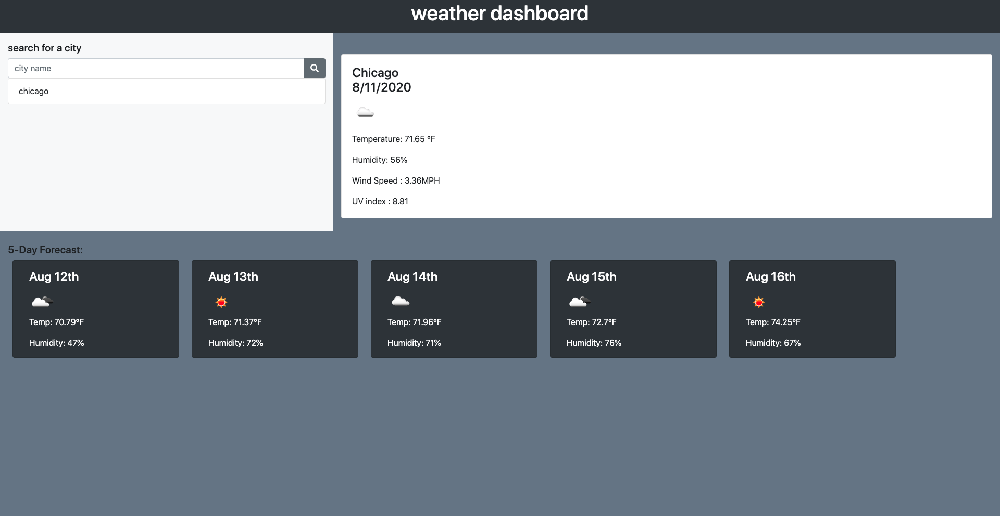

# 06 Server-Side APIs: Weather Dashboard

## Description

This application is a weather dashboard that displays weather conditions for multiple cities.  
When the user searches for a city, then the user is presented with current and future conditions for that city and that city is added to the search history.  
When the user views current weather conditions for that city, then the user is presented with the city name, the date, an icon representation of weather conditions, the temperature, the humidity, the wind speed, and the UV index. 
When the user views the UV index, then the user is presented with a color that indicates whether the conditions are favorable, moderate, or severe. 
When the user views future weather conditions for that city, then the user is presented with a 5-day forecast that displays the date, an icon representation of weather conditions, the temperature, and the humidity.  
When the user clicks on a city in the search history, then the user is again presented with current and future conditions for that city. 
When the user opens the weather dashboard, then the user is presented with the last searched city forecast.  

## Technologies

* HTML
* CSS
* jQuery
* Moment.js
* Open Weather API 

## Website

